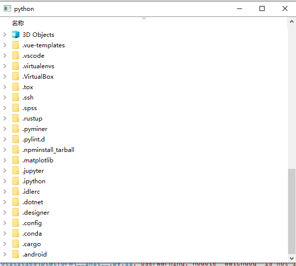
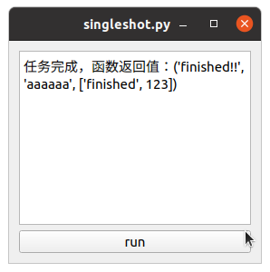

# pmgwidgets

#### 介绍
一个基于qtpy的代码编辑器，由纯Python代码编写，兼容PySide2和PyQt5。

这些代码可以用来解决PySide2下面缺少QScintilla绑定，而且web编辑器较为费资源的问题

该编辑器支持行号渲染、代码渲染、智能提示，但目前只有简单的例子。

本人英语水平不怎么样，因此写英文文档已经很费劲了。中文文档不如英文文档详尽,建议先看英文文档。

不过本人的汉语表达能力还挺可以的，因此你可以直接给我发邮件。我的邮箱：

1295752786@qq.com

小提示：也可以直接加我的QQ，即以上邮箱。


## 快速开始！
```python
from pmgwidgets import {控件名}
```

用以上语句即可导入相应的控件。
控件的有关示例见 ``pmgwidgets/tests`` 文件夹。
详细教程点击这里跳转：
[参数对话框](docs/pmgpanel_tutorial.md)

[文件树](docs/filetree_tutorial.md)

>注意，为了偷懒不写多版本翻译文件，在这些教程中，中英文是一一对应的参照关系，无需担心看不懂英文导致的理解问题。
> 
### 创建一个参数对话框面板
```python
from qtpy.QtWidgets import QApplication
from pmgwidgets import PMGPanel

views = [
    {"type": 'line_ctrl', 'name': 'name', 'title': 'What\'s your name?', 'init': 'hzy'},
    {'type': 'number_ctrl', 'name': 'age', 'title': 'How old are you?', 'init': 88,
     'unit': 'years old', 'range': (0, 150)},
    {'type': 'number_ctrl', 'name': 'height', 'title': 'How High could This Plane fly?', 'init': 12000,
     'unit': 'm', 'range': (10, 20000)},
    {'type': 'check_ctrl', 'name': 'sport', 'title': 'do you like sport', 'init': True},
    {'type': 'combo_ctrl', 'name': 'plane_type', 'title': 'Fighters(Ordered by production time)', 'init': 'f22',
     'choices': ['f22', 'j20', 'su57'], 'texts': ['Lockheed-Martin f22', '成都 j20', 'Сухо́й su57']},
    {'type': 'color_ctrl', 'name': 'color', 'title': 'Which color do u like?', 'init': (0, 200, 0)}
]
if __name__ == '__main__':
    app = QApplication([])
    panel = PMGPanel(views=views)

    panel.show()
    print('Panel Value', panel.get_value())
    app.exec_()
```
运行以上实例，即可获取这样的界面：


若要获取更多这种界面的说明信息, [点击这里](docs/pmgpanel_tutorial.md)

### 创建一个文件树
代码：
```python
# -*- coding:utf-8 -*-
# @Time: 2021/2/1 21:35
# @Author: Zhanyi Hou
# @Email: 1295752786@qq.com
# @File: filetree.py
import os
from qtpy.QtWidgets import QApplication
from pmgwidgets import PMGFilesTreeview

if __name__ == '__main__':
    import sys

    app = QApplication(sys.argv)

    tree = PMGFilesTreeview(os.path.expanduser('~'), None)
    tree.show()
    sys.exit(app.exec_())
```

要获取文件树的更多参考资料, [点击这里](docs/filetree_tutorial.md)


### 更加简单的线程集成
在PyQt5/PySide2中，停止QThread和启动往往要消耗数十行。在这里，我们提供了QThread的封装，以更加简便的调用后台线程处理事情。
```python
import sys
import time

from pmgwidgets import PMGOneShotThreadRunner
from qtpy.QtWidgets import QTextEdit, QApplication, QWidget, QVBoxLayout, QPushButton


def run(loop_times):
    for i in range(loop_times):
        print(i)
        time.sleep(1)
    return 'finished!!', 'aaaaaa', ['finished', 123]


def single_shoot():
    global oneshot, textedit
    if oneshot is not None:
        if oneshot.is_running(): # 如果后台线程已经在运行，那么就不要重新创建，否则可能造成程序崩溃。在实际程序中可以考虑加一个弹出框来进行提示。
            return
    oneshot = PMGOneShotThreadRunner(run, args=(3,))
    oneshot.signal_finished.connect(lambda x: textedit.append('任务完成，函数返回值：' + repr(x)))# The text means: "Tasks finished. The return value is:"+repr(x)


oneshot = None
app = QApplication(sys.argv)
basewidget = QWidget()
basewidget.setLayout(QVBoxLayout())

textedit = QTextEdit()
pushbutton = QPushButton('run')
pushbutton.clicked.connect(single_shoot)
basewidget.layout().addWidget(textedit)
basewidget.layout().addWidget(pushbutton)
basewidget.show()
sys.exit(app.exec_())

```
点击“run”按钮，运行程序。三秒之后就可以看到后台处理完的结果被显示在了界面上。


要获得后台线程处理的更多信息 [点击这里](docs/threading_and_tasking.md)

