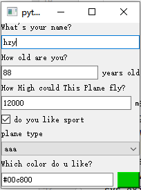
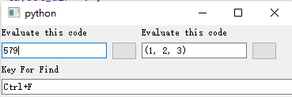
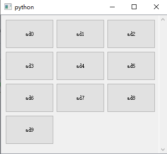
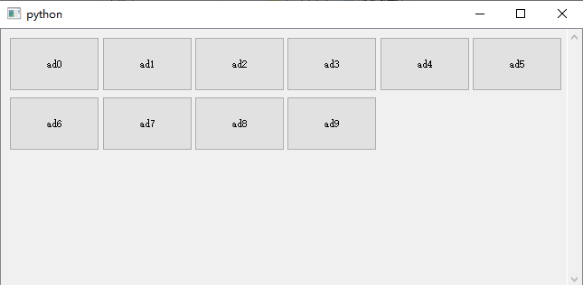

==============================================================================
PyMiner控件介绍
==============================================================================

.. automodule:: pmgwidgets

.. toctree::
    :maxdepth: 2

    display/index.rst
    elements/index.rst
    flowchart/index.rst
    utilities/index.rst
    widgets/index.rst
    docs/threading_and_tasking.md

.. sectionauthor:: 侯展意

.. code-block:: python

    from pmgwidgets import {控件名}

用以上语句即可导入相应的控件。
控件的有关示例见 ``pmgwidgets/tests`` 文件夹。

快速布局控件PMGPanel
=====================

查看本文中的示例即可。运行示例即可得到以下界面：

数据结构与格式
----------------

创建这个界面只需要一个json式的数据结构，如下所示：

.. code-block:: python

    views = [('line_ctrl', 'name', 'What\'s your name?', 'hzy'),
             ('number_ctrl', 'age', 'How old are you?', 88, 'years old', (0, 150)),
             ('number_ctrl', 'height', 'How High could This Plane fly?', 12000, 'm', (10, 20000)),
             ('check_ctrl', 'sport', 'do you like sport', True),
             ('combo_ctrl', 'plane_type', 'plane type', 'f22', ['f22', 'f18', 'j20', 'su57'],
              ['f22战斗机', 'f18战斗轰炸机', 'j20战斗机', 'su57战斗机']),
             ('color_ctrl', 'color', 'Which color do u like?', (0, 200, 0))]

这些数据的格式为：

数据类型；数据名称；提示信息；初始值。第四位之后的其他数据为修饰信息，比如单位、范围等。

下表中第2和第3项分别为名称和提示文字。由于其不太重要，故将其省略。

===================================================== ===================== ============================== ======================================= ======================== ================
 作用及返回值类型                                      1:选择器名称          4：初始值                        5                                       6
===================================================== ===================== ============================== ======================================= ======================== ================
 字符串型数据（str）                                   ``line_ctrl``         初始值：str                    /
 整型或者浮点（int/float）字符串型（str）              ``number_ctrl``       int/float初始值：str           单位str                                      范围（min,max）
 颜色（返回形如 ``#a0b89d`` 的颜色字符串）             ``color_ctrl``        tupleRGB,每位为0~255的整数     /
 单行表达式求值( ``object`` )                          ``eval_ctrl``         str                            /
 文件选择(str)                                         ``file_ctrl``         str,如 ``c:\work``  相对路径   /
 文件夹选择(str)                                       ``folder_ctrl``       str如  ``D:\work\my.txt``      /
 多行文本编辑(str)                                     ``editor_ctrl``       str                            语法高亮名称（str）比如：``python``
 复选框(bool)                                          ``check_ctrl``        bool
 下拉列表框（Combobox）任意类型，多选一（ ``str`` ）   ``combo_ctrl``        object（任意类型）*            选项列表                                     选项文本列表
 列表编辑器([[文本],[元素id]])                         ``list_ctrl``         List[List,List]
 时间输入微调框                                        ``time_ctrl``
 日期输入微调框                                        ``date_ctrl``         date的元组/列表
 日期和时间输入微调框                                  ``datetime_ctrl``     datetime元组/列表
 数字微调框                                            ``numberspin_ctrl``   int/float                      单位str                                      范围（min,max）           步长
===================================================== ===================== ============================== ======================================= ======================== ================

.. note::

    #. ``date`` 的元组/列表示例： ``(1970,7,21)`` 代表1970年7月21日；
    #. ``datetime`` 的元组/列表示例： ``(1972,1,2,1,23,45)`` 代表1972年1月2日1时23分45秒；
    #. 下拉列表框的输入列表可以填入任意类型。但是你所输入的初始值，必须在选项列表中存在，否则会抛出异常。

创建一个设置面板
------------------

JSON说明
^^^^^^^^^^

Json是一个list列表。按照 **从上到下** 的顺序排列各个界面元素。

每个界面元素是一个以字符串名称作为首项的列表或元组。

#. 控件列表可以在初始化的时候传入，像这样：

.. code-block:: python

    views = [('line_ctrl', 'name', 'What\'s your name?', 'hzy'),
             ('number_ctrl', 'age', 'How old are you?', 88, 'years old', (0, 150))]
    sp = PMGPanel(views=views, layout_dir='v')

控件列表也可以在初始化完成之后使用set_items方法设置：

.. code-block:: python

    views = [('line_ctrl', 'name', 'What\'s your name?', 'hzy'),
             ('number_ctrl', 'age', 'How old are you?', 88, 'years old', (0, 150))]
    sp = PMGPanel()
    sp.set_items(views)

写法与初始化时相同。

#. ``set_items`` 可以多次调用。如果调用的时候设置面板不为空，那么之前的设置项都会被清空。
#. 使用嵌套表，可以在同一行按照从左到右的顺序放置多个控件（最多嵌套一层）。如下图效果，代码如下：

.. code-block:: python

    from pmgwidgets import PMGPanel
    import sys
    from qtpy.QtWidgets import QApplication
    app = QApplication(sys.argv)
    views = [
        [
            ('eval_ctrl', 'code_eval', 'Evaluate this code', 123 + 456, 'normal'),
            ('eval_ctrl', 'code_eval2', 'Evaluate this code', (1, 2, 3), 'safe')
        ],
        ('keymap_ctrl', 'key_map2', 'Key For Find', 'Ctrl+F'),
    ]
    sp2 = PMGPanel(views=views, layout_dir='v')
    sp2.set_items(views)
    sp2.show()
    sys.exit(app.exec_())

获取单个控件
----------------

调用 ``get_ctrl(ctrl_name:str)`` 方法,可以获取其上的控件。

如：

.. code-block:: python

    views = [('line_ctrl', 'name', 'What\'s your name?', 'hzy'),
             ('number_ctrl', 'age', 'How old are you?', 88, 'years old', (0, 150))]
    sp = PMGPanel(views=views, layout_dir='v')
    name_widget = sp.get_ctrl('name')

#. 注意：如果控件名称不存在，则返回 ``None`` 。注意做好类型判断。

获取值
------------

获取单个控件值
^^^^^^^^^^^^^^^^

获取控件之后，调用控件的set_value方法。

.. code-block:: python

    views = [('line_ctrl', 'name', 'What\'s your name?', 'hzy'),
             ('number_ctrl', 'age', 'How old are you?', 88, 'years old', (0, 150))]
    sp = PMGPanel(views=views, layout_dir='v')
    name_widget = sp.get_ctrl('name')
    name_widget.get_value()

获取整体值
^^^^^^^^^^^^^^

调用 ``SettingsPanel`` 的 ``get_value()`` 方法，可以返回一个字典。键就是以上表格的“数据名称”列，返回的是相应的值。

如果未做任何改动，那么返回的值就是初始值，也就是表格“初始值”列的内容。

比如之前所述的 ``views`` 列表输入的初始值，最终得出的结果是这样的 ``dict`` ：

.. code-block:: python

    >> sp.get_value()
    {'name': 'hzy', 'age': 88.0, 'height': 12000.0, 'sport': True, 'plane_type': 'f22', 'color': (0, 200, 0)}

设置值
-----------

设置单个控件值
^^^^^^^^^^^^^^^^^^

比如之前所述的 ``views`` 列表输入的初始值，最终得出的结果是这样的 ``dict`` ：

.. code-block:: python

    views = [('line_ctrl', 'name', 'What\'s your name?', 'James'),
             ('number_ctrl', 'age', 'How old are you?', 88, 'years old', (0, 150))]
    sp = PMGPanel(views=views, layout_dir='v')
    name_widget = sp.get_ctrl('name')
    name_widget.set_value("John")

set_value方法传入的参数，类型必须与初始值相同。

整体设置值
^^^^^^^^^^^^

比如之前所述的``views``列表输入的初始值，最终得出的结果是这样的``dict``：

.. code-block:: python

    views = [('line_ctrl', 'name', 'What\'s your name?', 'James'),
             ('number_ctrl', 'age', 'How old are you?', 88, 'years old', (0, 150)),
            ('number_ctrl', 'age2', 'How old are you?', 88, 'years old', (0, 150))
            ]
    sp = PMGPanel(views=views, layout_dir='v')
    sp.set_value({'name':'hzy','age':123})

这样的话会将``'name'``控件值改为``'hzy'``,``'age'``控件值改为``123``。

- 如果输入字典的键不存在，则会发出报错。

- 不必在输入字典中对全部控件名都进行设置，只要存在即可。

设置控件的参数
------------------

调用 ``set_params(*params)`` 方法。

``params`` 指的是从表格的 ``初始值`` 列之后的几项。比如选择菜单的选项、数据型输入框的范围。

控件的参数指的就是从第5项开始（含第5项）以后的内容。比如对于一个数值型控件：

如：

.. code-block:: python

    views = [('line_ctrl', 'name', 'What\'s your name?', 'hzy'),
             ('number_ctrl', 'age', 'How old are you?', 88, 'years old', (0, 150))]
    sp = PMGPanel(views=views, layout_dir='v')
    num_widget = sp.get_ctrl('name')
    if num_widget is not None:
        num_widget.set_params('years old',(10,145))

以上示例就是把年龄范围从0~150岁设置到了10~145岁。如果你不希望改变其他设置（比如这里的 ``'years old'`` ），
将原有的值重新写一遍就可以了。

.. note::

    如果控件名称不存在，则返回``None``。注意做好类型判断。

禁用和启用单个控件（设置灰色）
----------------------------------

.. code-block:: python

    views = [('line_ctrl', 'name', 'What\'s your name?', 'hzy'),
             ('number_ctrl', 'age', 'How old are you?', 88, 'years old', (0, 150))]
    sp = PMGPanel(views=views, layout_dir='v')
    sp.get_ctrl('name').setEnabled(False) # 禁用name控件
    sp.get_ctrl('name').setEnabled(True)  # 启用name控件

示例：

.. code-block:: python

    import sys

    from qtpy.QtWidgets import QApplication

    from pmgwidgets import PMGPanel
    if __name__ == '__main__':
        app = QApplication(sys.argv)
        # 类型；名称；显示的提示文字;初始值；//单位；范围
        views = [('line_ctrl', 'name', 'What\'s your name?', 'hzy'),
                 ('number', 'age', 'How old are you?', 88, 'years old', (0, 150)),
                 ('number', 'height', 'How High could This Plane fly?', 12000, 'm', (10, 20000)),
                 ('bool', 'sport', 'do you like sport', True),
                 ('choose_box', 'plane_type', 'plane type', 'f22', ['f22', 'f18', 'j20', 'su57'],
                  ['f22战斗机', 'f18战斗轰炸机', 'j20战斗机', 'su57战斗机']),
                 ('color', 'color', 'Which color do u like?', (0, 200, 0))]
        sp = PMGPanel(views=views, layout_dir='v')
        sp.widgets_dic['plane_type'].set_choices(['aaa', 'vvvvv', 'xxxxxx'])
        sp.set_items(views[3:6])
        sp.show()
        sp2 = PMGPanel(views=views, layout_dir='h')
        sp2.show()
        sp2.setMaximumHeight(30)
        val = sp.get_value()  # 返回一个字典。初始值为表格的第二列：第四列。
        print(val)
        sys.exit(app.exec_())

文件树控件
=============

.. code-block:: python

    class PMGFilesTreeview(QTreeView):

如何插入界面
--------------

.. code-block:: python

    def __init__(self, initial_dir: str = '', parent=None):
        # initial_dir:str,初始时的路径。
        # parent:父控件，可以为None。

信号
----------

============================================ =======================================================================================
                信号                                              说明
============================================ =======================================================================================
    new_file_signal = Signal(str)               新建文件信号，返回一个参数，是新建文件的绝对路径
    new_folder_signal = Signal(str)             新建文件夹信号，返回一个参数，是新建文件夹的绝对路径
    delete_file_signal = Signal(str)            删除文件或者文件夹信号，返回一个参数，是文件夹的绝对路径。
    rename_file_signal = Signal(str, str)       文件重命名的信号，返回两个参数，分别是重命名之前的绝对路径和重命名之后的绝对路径。
============================================ =======================================================================================

.. note::

    以上信号都是只有操作成功才会被触发的。
    **如果操作不成功（比如重命名时存在相同文件、删除文件时权限不够），那么就不会触发。**。

容器控件
==============

流式布局控件PMFlowArea
------------------------

流式布局控件为PMFlowArea，示例见tests文件夹的flow_layout_widget.py。

运行这个例子可以发现以下效果：

可以看到，布局在界面左右拖拽的时候，按钮会自动重排。
问题：控件库的按钮自动重排之前，似乎不是从0,0开始添加按钮的。

选项卡控件PMGTabWidget
---------------------------

(这里名字不对！需要改过来！！)
是选项卡控件。
选项卡控件的特点是，它的setup_ui方法中，会调用子界面的setup_ui方法。同理也适用于bind_events。

可停靠控件PMGDockWidget
----------------------------

额外定义了raise_into_view的方法，调用这方法时可以保证此控件提升到窗口最顶端。

[TODO]:需要考虑将窗口也增设进来！

相关函数和方法
==============

文件操作
------------

rename_file(prev_absolute_path:str, new_absolute_path:str)->bool
^^^^^^^^^^^^^^^^^^^^^^^^^^^^^^^^^^^^^^^^^^^^^^^^^^^^^^^^^^^^^^^^^^^^^

重命名文件或者文件夹

prev_absolute_path:之前的绝对路径

new_absolute_path:新的绝对路径

返回值：True为操作成功，False为不成功（比如已有文件或者文件夹与新的名称重名）

move_to_trash（path:str）->bool
^^^^^^^^^^^^^^^^^^^^^^^^^^^^^^^^

path:要移到回收站的文件夹的绝对路径。

返回值：True为操作成功，False为不成功。

执行系统命令
-----------------

[!TODO]

run_command_in_terminal(打开系统终端并在其中执行命令。)
^^^^^^^^^^^^^^^^^^^^^^^^^^^^^^^^^^^^^^^^^^^^^^^^^^^^^^^^^^^^^

在终端命令行中运行命令。

.. code-block:: python

    from pmgwidgets import run_command_in_terminal

    def test_run_in_terminal():
        import time
        run_command_in_terminal('dir', close_mode='no')
        time.sleep(1)
        run_command_in_terminal('dir', close_mode='wait_key')
        time.sleep(1)
        run_command_in_terminal('dir', close_mode='auto')

    test_run_in_terminal()

close_mode的意思时命令执行完之后终端怎么做。当其为 ``no`` 的时候，终端不退出，可以输入命令继续执行下一条；
显示为 ``wait_key`` 的时候，终端等待按任意键退出；
显示为 ``auto`` 的时候，终端执行完之后就退出——所以执行 ``dir`` 一类秒完成的命令，就会闪现一下，然后便不见了。

